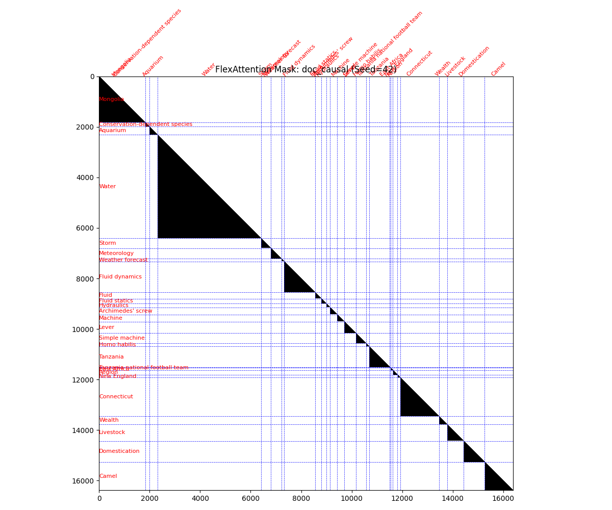
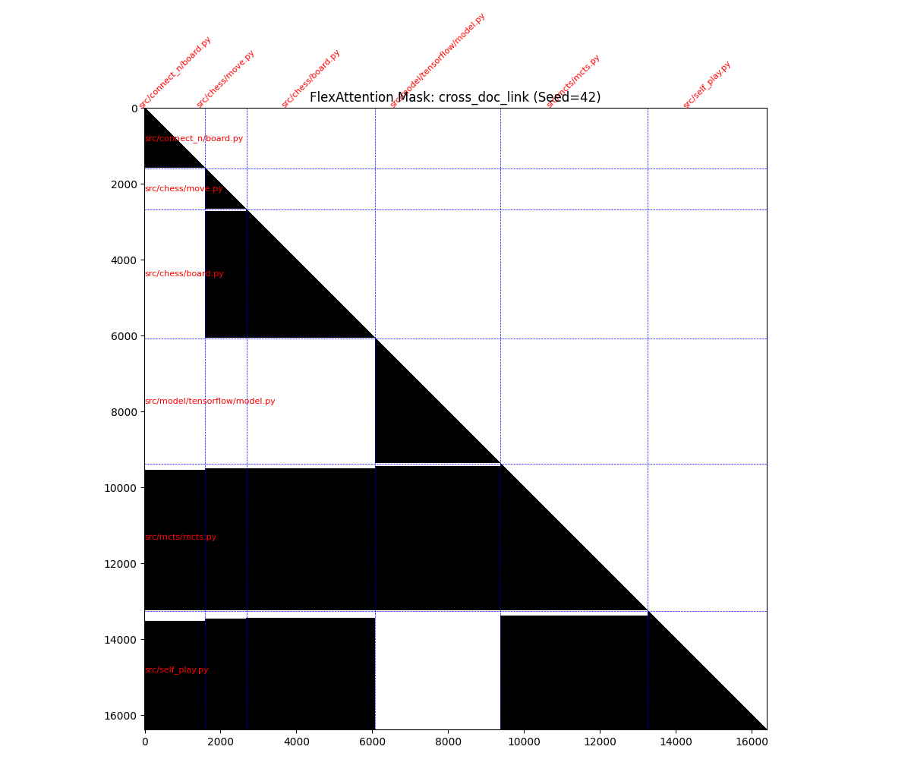

# Text Attributed Graph Sequence to Text Attributed Graph Sequence (TAGSeq2TAGSeq)

A framework for training language models on **graph-structured text** — where documents are nodes and hyperlinks or import dependencies are edges. Rather than treating corpora as flat token streams, this project makes the link structure a first-class part of both training and inference.

See [INSTRUCTIONS.md](INSTRUCTIONS.md) for full pipeline, training, and generation commands.

---

## The Core Idea

Most text corpora have implicit graph structure that standard language model training ignores. A Wikipedia article on *Fluid dynamics* links to *Hydraulics*, *Archimedes' screw*, and *Lever*. A Python file `mcts.py` imports `chess/board.py`, `chess/move.py`, and `model/tensorflow/model.py`. These links are not noise — they signal that the linked content is semantically relevant to the current document.

TAGSeq2TAGSeq exploits this structure in two ways:

1. **Graph traversal packs related documents together.** Instead of sampling random token windows, a graph traversal (BFS or DFS) walks the link graph and fills each training sequence with documents that are topologically close to one another.

2. **A custom attention mask decides what each token can see.** At minimum, documents are causally isolated from one another — tokens in one article cannot attend to tokens in an unrelated article packed into the same sequence. Optionally, when document A explicitly links to document B and both are in the batch, tokens in A can attend back across the document boundary into B.

---

## Attention Masks

The attention pattern is the heart of the method. Two examples are shown below, both on the same 16k-token batch.

### `doc_causal` — document-isolated causal attention

Each document attends only to itself. The mask is a block-diagonal of lower triangles: no information crosses document boundaries. This is the baseline — equivalent to training on independently sampled documents, but with the efficiency benefit of packing many short documents into one long sequence.



*Each diagonal block is one Wikipedia article. Blue dashed lines mark document boundaries. Documents are completely isolated from one another.*

---

### `cross_doc_link` — link-aware cross-document attention

When document A contains a link to document B (and B is present in the batch), all tokens in A are granted read-access to all tokens in B. The causal structure within each document is preserved; the cross-document grants are asymmetric (A can read B, but B cannot read A unless it also links back).



*Python files from the same repository. `src/mcts/mcts.py` and `src/self_play.py` import earlier files in the batch — their rows extend leftward as large black blocks. Documents that share no imports remain isolated.*

This teaches the model a grounded form of cross-document reasoning: when you encounter an import or a hyperlink, the full content of the referenced document is available in your attention context.

---

## Graph Traversal

How documents are ordered within a sequence matters for `cross_doc_link`: a document can only attend to documents that appear *before* it in the sequence. The traversal strategy controls this ordering.

- **BFS** (breadth-first): explores the neighbourhood of a seed document level by level. Documents close in graph distance are packed together and predecessors tend to appear before successors. This is the preferred strategy for `cross_doc_link` training.
- **DFS** (depth-first): follows one path deep into the graph before backtracking. Produces longer chains of topically related documents.
- **Random walk**: a Markov walk with restart probability, producing soft locality without strict BFS ordering.
- **Random**: uniform random selection — equivalent to standard document sampling, used as a control baseline.

Within each strategy, a token budget and per-document token cap control sequence length and ensure no single document dominates the pack.

---

## Datasets

The framework currently supports four pretokenized datasets and has several more in progress, spanning three distinct link-structure modalities.

### Ready

| Dataset | Edge type | Nodes | Tokens |
|---------|-----------|-------|--------|
| **SimpleWiki** | Markdown hyperlinks | 275k | ~108M |
| **EnWikiSource** | Markdown hyperlinks | 662k | ~612M |
| **The Stack (10M)** | Python `import` statements | 2.38M | ~7B |
| **The Stack (100M)** | Python `import` statements | 3.56M | ~8.7B |

### Planned

**Combined Wikipedia** — multiple language or thematic wiki dumps merged into a single graph. Cross-dump links and redirect edges give the graph richer connectivity than any single dump alone.

**arXiv (LaTeX source)** — papers as nodes; edges from `\cite{}` bibliography references and `\input{}`/`\include{}` file inclusions. Gives the model exposure to structured scientific writing where citations are semantically meaningful dependencies, not just footnotes.

**Obsidian vault** — a personal note-taking graph where `[[wikilink]]` syntax connects notes. Edges reflect the author's own associative structure rather than an editorial or codebase convention, making this a qualitatively different kind of graph: sparse, idiosyncratic, and highly personal.

**Multi-dataset composition** — a dataset abstraction that mixes multiple corpora (e.g. Wikipedia + arXiv + code) in a single training run, with per-dataset link detectors dispatched based on document provenance. This requires handling heterogeneous edge types within the same batch.

### Link detectors

Each modality is served by a pluggable `LinkDetector` that runs online — during training to identify which token positions correspond to links, and during generation to detect links in newly generated text:

| Detector | Used for |
|----------|---------|
| `MarkdownLinkDetector` | Wikipedia, Obsidian (`[[...]]` and `[text](url)` syntax) |
| `PythonImportDetector` | The Stack (`import` / `from ... import`) |
| *(planned)* `LatexCiteDetector` | arXiv (`\cite{...}`, `\input{...}`) |

---

## Model Architecture

The model is a standard decoder-only transformer with rotary position embeddings, trained with bfloat16 mixed precision and the Muon optimizer (for 2D weight matrices) combined with AdamW (for embeddings and norms). Weight tying connects the embedding and unembedding matrices.

The only architectural novelty is the **FlexAttention block mask**: instead of materialising a dense `T×T` attention matrix (expensive at 32k context), PyTorch's FlexAttention API compiles the mask logic into a sparse block representation, making long-context training tractable.

Supported configurations range from 12L/768D (GPT-2 scale, 2k context) to 36L/1280D (medium scale, 32k context). Multi-node training is handled via DDP with SLURM/submitit.

---

## Generation

At inference time, `generate.py` loads a checkpoint and generates text autoregressively. When `--max-link-depth` is greater than zero, the model runs a link-detection pass after each token is generated. Links that resolve to documents in the corpus are fetched and prepended to the attention context before generation continues — a retrieval mechanism that mirrors exactly what the model was trained to expect.

For links that do not resolve to corpus documents, `--allow-generation-fallback` triggers generation of the auxiliary document from scratch, enabling open-ended multi-document synthesis.

---

## Repository Layout

```
main.py                          Training entry point (single-node or DDP)
launch_slurm.py                  Multi-node SLURM launcher (submitit)
generate.py                      Generation CLI
configs/                         YAML training configurations
data/
  dataset.py                     GraphIndex, PretokShardedBackend
  packed_dataset.py              PackedSequenceDataset (IterableDataset)
  traversal.py                   BFS, DFS, RandomWalk, Random strategies
  pack_sampler.py                Token-budget-aware batch construction
  pretokenize.py / pretokenize_stack.py   Raw data → binary shards
  wiki_graph_extractor/          Wikipedia dump → articles + graph
  github_graph_extractor/        The Stack → Python files + import graph
model/
  model.py                       TS2TSModel (inference wrapper)
  modules/training_module.py     TS2TSTrainingModule (nn.Module, loss out)
  graph_traversal/
    block_mask_creator.py        FlexAttention mask registry + visualiser
    cross_doc_mask.py            CrossDocLinkMaskCreator
    markdown_link_detector.py    Detects [[WikiLinks]] in token streams
    python_import_detector.py    Detects `import` statements in token streams
  generation_loop.py             run_generation, link-detection loop
  document_context.py            DocumentContext (inference context window)
docs/images/                     Committed mask visualisations
```

Full pipeline instructions (data extraction, pretokenization, training, generation) are in [INSTRUCTIONS.md](INSTRUCTIONS.md).

## TODOs
in no particular priority order
- [ ] make ArXiv LaTeX dataset
- [ ] pull out actual validation splits
  - [ ] one sparse & random doc
  - [ ] one from dense sub-clusters
- [ ] integrate in easy LLM benchmarks (likely specific sub-tasks from larger benchmarks like MMLU; whatever i think these models can handle & preferably stuff that'd benefit from cross-document understanding)
- [ ] write custom cross-doc-link FA2 kernel since FlexAttention's backward pass is so absurdly slow
- [ ] build batch mask density pre-computation system to ensure ranks spend less time waiting for whichever rank has the densest mask
- [ ] finish inference generation logic
- [ ] preprocess code data to make imports lazy & thus save on computation
- [ ] make a more complicated python-linter-based mask that allows only the relevant scope of the code in a given doc to attend to what it's importing rather than
- [ ] update to the latest methods from the `kellerjordan/modded-nanogpt/` repo
- [ ] check for feasability of integrating `karpathy/nanochat/` RL & chat pipeline and how we might edit that pipeline to take advantage of this model's new features
- [ ] actually train reasonable sized models for each ablation: (random, random-walk, dfs, bfs) x (doc-causal, cross-doc-link)
- [ ] softmax flattening out is likely our largest issue (alongside the huge runtime increase); can we find some other form of attention that helps fix this (i think i vaguely remember one called differential or diff attention)