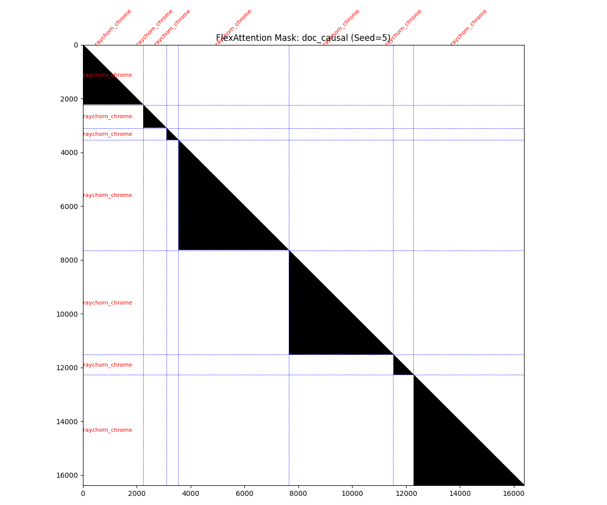
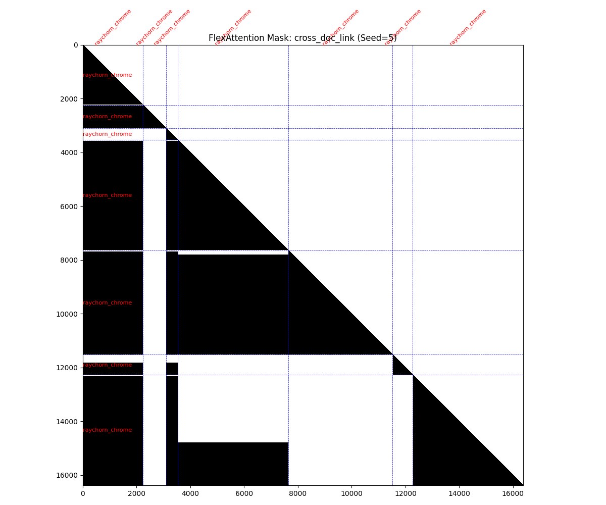
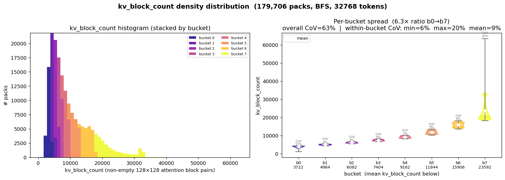
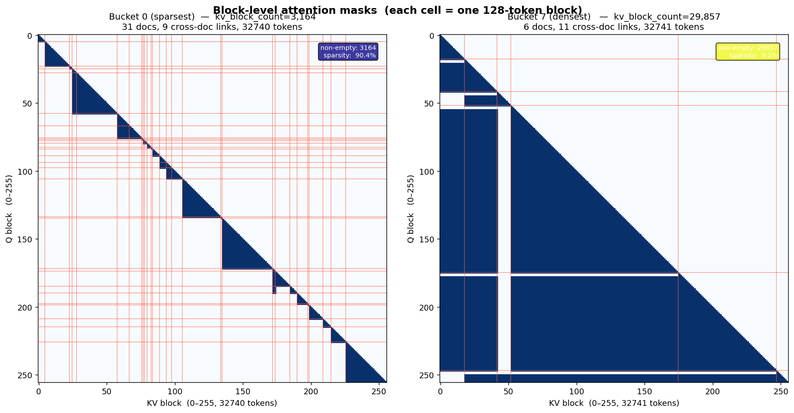
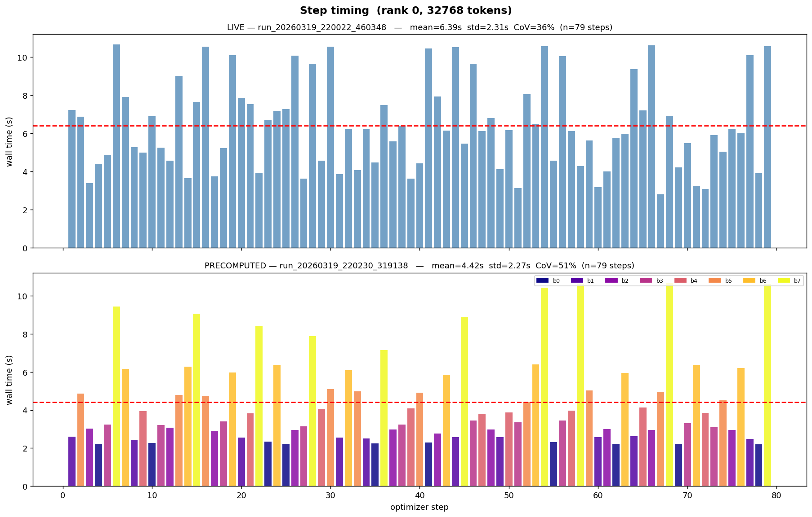
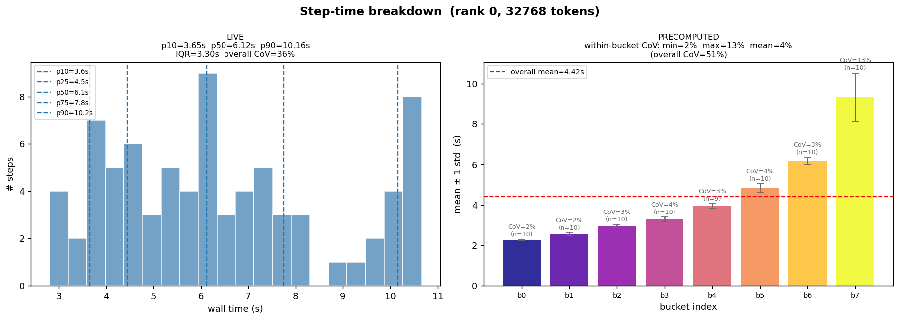

# Text Attributed Graph Sequence to Text Attributed Graph Sequence (TAGSeq2TAGSeq)

A framework for training language models on **graph-structured text** — where documents are nodes and hyperlinks or import dependencies are edges. Rather than treating corpora as flat token streams, this project makes the link structure a first-class part of both training and inference.

See [INSTRUCTIONS.md](INSTRUCTIONS.md) for full pipeline, training, and generation commands.

---

## The Core Idea

Most text corpora have implicit graph structure that standard language model training ignores. A Wikipedia article on *Fluid dynamics* links to *Hydraulics*, *Archimedes' screw*, and *Lever*. A Python file `mcts.py` imports `chess/board.py`, `chess/move.py`, and `model/tensorflow/model.py`. These links are not noise — they signal that the linked content is semantically relevant to the current document.

TAGSeq2TAGSeq exploits this structure in two ways:

1. **Graph traversal packs related documents together.** Instead of sampling random token windows, a graph traversal (BFS or DFS) walks the link graph and fills each training sequence with documents that are topologically close to one another.

2. **A custom attention mask decides what each token can see.** At minimum, documents are causally isolated from one another — tokens in one article cannot attend to tokens in an unrelated article packed into the same sequence. Optionally, when document A explicitly links to document B and both are in the batch, tokens in A can attend back across the document boundary into B.

---

## Attention Masks

The attention pattern is the heart of the method. Two examples are shown below, both on the same 16k-token batch.

### `doc_causal` — document-isolated causal attention

Each document attends only to itself. The mask is a block-diagonal of lower triangles: no information crosses document boundaries. This is the baseline — equivalent to training on independently sampled documents, but with the efficiency benefit of packing many short documents into one long sequence.



*Each diagonal block is one Wikipedia article. Blue dashed lines mark document boundaries. Documents are completely isolated from one another.*

---

### `cross_doc_link` — link-aware cross-document attention

When document A contains a link to document B (and B is present in the batch), all tokens in A are granted read-access to all tokens in B. The causal structure within each document is preserved; the cross-document grants are asymmetric (A can read B, but B cannot read A unless it also links back).



*Python files from the same repository. `src/mcts/mcts.py` and `src/self_play.py` import earlier files in the batch — their rows extend leftward as large black blocks. Documents that share no imports remain isolated.*

This teaches the model a grounded form of cross-document reasoning: when you encounter an import or a hyperlink, the full content of the referenced document is available in your attention context.

---

## Graph Traversal

How documents are ordered within a sequence matters for `cross_doc_link`: a document can only attend to documents that appear *before* it in the sequence. The traversal strategy controls this ordering.

- **BFS** (breadth-first): explores the neighbourhood of a seed document level by level. Documents close in graph distance are packed together and predecessors tend to appear before successors. This is the preferred strategy for `cross_doc_link` training.
- **DFS** (depth-first): follows one path deep into the graph before backtracking. Produces longer chains of topically related documents.
- **Random walk**: a Markov walk with restart probability, producing soft locality without strict BFS ordering.
- **Random**: uniform random selection — equivalent to standard document sampling, used as a control baseline.

Within each strategy, a token budget and per-document token cap control sequence length and ensure no single document dominates the pack.

---

## Datasets

The framework currently supports four pretokenized datasets and has several more in progress, spanning three distinct link-structure modalities.

### Ready

| Dataset | Edge type | Nodes | Tokens |
|---------|-----------|-------|--------|
| **SimpleWiki** | Markdown hyperlinks | 275k | ~108M |
| **EnWikiSource** | Markdown hyperlinks | 662k | ~612M |
| **The Stack (10M)** | Python `import` statements | 2.38M | ~7B |
| **The Stack (100M)** | Python `import` statements | 3.56M | ~8.7B |

### Planned

**Combined Wikipedia** — multiple language or thematic wiki dumps merged into a single graph. Cross-dump links and redirect edges give the graph richer connectivity than any single dump alone.

**arXiv (LaTeX source)** — papers as nodes; edges from `\cite{}` bibliography references and `\input{}`/`\include{}` file inclusions. Gives the model exposure to structured scientific writing where citations are semantically meaningful dependencies, not just footnotes.

**Obsidian vault** — a personal note-taking graph where `[[wikilink]]` syntax connects notes. Edges reflect the author's own associative structure rather than an editorial or codebase convention, making this a qualitatively different kind of graph: sparse, idiosyncratic, and highly personal.

**Multi-dataset composition** — a dataset abstraction that mixes multiple corpora (e.g. Wikipedia + arXiv + code) in a single training run, with per-dataset link detectors dispatched based on document provenance. This requires handling heterogeneous edge types within the same batch.

### Link detectors

Each modality is served by a pluggable `LinkDetector` that runs online — during training to identify which token positions correspond to links, and during generation to detect links in newly generated text:

| Detector | Used for |
|----------|---------|
| `MarkdownLinkDetector` | Wikipedia, Obsidian (`[[...]]` and `[text](url)` syntax) |
| `PythonImportDetector` | The Stack (`import` / `from ... import`) |
| *(planned)* `LatexCiteDetector` | arXiv (`\cite{...}`, `\input{...}`) |

---

## Density-Aware Batch Scheduling

Cross-document attention masks are inherently **sparse** — how sparse depends on how many inter-file import links are active in a given pack. In a 32k-token sequence with 6 large files that heavily import each other, most attention blocks are live. In a pack with 31 small isolated files, almost all blocks are empty. This 6× variation in FlexAttention backward cost is the main source of DDP rank imbalance: the fast rank finishes its backward and then idles at the NCCL allreduce waiting for the slow rank to catch up.

### The problem in numbers

The `kv_block_count` metric counts non-empty 128-token block pairs in the full attention mask. Across 180k packs from The Stack (32k context, BFS, 8 buckets):



*Left: kv_block_count is right-skewed — most packs are sparse, but the dense tail drives worst-case step times. Right: each bucket has tight within-bucket variance; the ratio between sparsest (b0) and densest (b7) buckets is 6.3×.*

The mask for a representative pack from each extreme bucket makes the difference visceral:



*Each cell is one 128-token block; blue = non-empty. Bucket 0 (31 short docs, 9 links): isolated diagonal triangles, 90% sparse. Bucket 7 (6 large docs, 11 links): large filled rectangles from cross-doc grants, only 9% sparse. Red lines mark document boundaries.*

### The solution

**Offline epoch pre-computation** with **density-bucketed training**:

1. Before training, run `precompute_epochs.py` once per epoch. It generates all packs for the epoch using the same BFS traversal and link detection as live training, then computes `kv_block_count` analytically (~1 ms/pack, CPU only, parallelised across workers). Packs are sorted into equal-count quantile buckets.

2. During training, `BucketedPackDataset` draws each accum step's `world_size` packs from the **same** density bucket, guaranteeing all ranks see the same backward cost. The bucket sequence shuffles across buckets so each optimizer step spans a different density level, maintaining gradient diversity.

This eliminates within-step rank imbalance entirely. Different optimizer steps vary in speed (the scheduler visits all buckets), but all ranks are always equally loaded.

### Measured impact (2 nodes × 2 GPUs, The Stack 10M, 32k tokens)



*Top: live training — unpredictable step times (2–11s) with no structure. Bottom: precomputed training — steps colour-coded by density bucket; dark blue (sparse) is fast, yellow (dense) is slow, but the pattern is fully deterministic.*

The per-bucket breakdown makes the contrast concrete:



*Left: live training has a broad, near-uniform step-time distribution (IQR=3.3s, CoV=36%) — no bucket structure because packs are assigned randomly. Right: precomputed training has tiny within-bucket variance (CoV 2–13%, mean 4%) because both ranks always draw from the same bucket; the overall CoV (51%) is entirely between buckets — predictable and density-driven.*

| | Mean step time | Max step time |
|---|---|---|
| Live (online link detection, random density) | 6.39 s | 10.7 s |
| Precomputed (density-bucketed, no link detection) | 4.42 s | 9.4 s |
| **Speedup** | **1.45×** | **1.14×** |

The 1.45× mean speedup comes from two combined effects:
- **Eliminating online link detection** (`PythonImportDetector` at 32k tokens adds ~1.3 s/step on average; precomputed packs store link positions offline).
- **Rank-stall reduction** from density matching (most visible on multi-node InfiniBand; effectively zero on single-node NVLink).

See [INSTRUCTIONS.md](INSTRUCTIONS.md#density-aware-batch-scheduling) for full usage.

---

## Model Architecture

The model is a standard decoder-only transformer with rotary position embeddings, trained with bfloat16 mixed precision and the Muon optimizer (for 2D weight matrices) combined with AdamW (for embeddings and norms). Weight tying connects the embedding and unembedding matrices.

The only architectural novelty is the **FlexAttention block mask**: instead of materialising a dense `T×T` attention matrix (expensive at 32k context), PyTorch's FlexAttention API compiles the mask logic into a sparse block representation, making long-context training tractable.

Supported configurations range from 12L/768D (GPT-2 scale, 2k context) to 36L/1280D (medium scale, 32k context). Multi-node training is handled via DDP with SLURM/submitit.

---

## Generation

At inference time, `generate.py` loads a checkpoint and generates text autoregressively. When `--max-link-depth` is greater than zero, the model runs a link-detection pass after each token is generated. Links that resolve to documents in the corpus are fetched and prepended to the attention context before generation continues — a retrieval mechanism that mirrors exactly what the model was trained to expect.

For links that do not resolve to corpus documents, `--allow-generation-fallback` triggers generation of the auxiliary document from scratch, enabling open-ended multi-document synthesis.

---

## Repository Layout

```
main.py                          Training entry point (single-node or DDP)
launch_slurm.py                  Multi-node SLURM launcher (submitit)
generate.py                      Generation CLI
precompute_epochs.py             Offline epoch pre-computation for density-aware batching
visualize_epoch.py               Density / mask / timing visualisations for a pre-computed epoch
configs/                         YAML training configurations
schedules/                       Pre-computed epoch directories (packs.parquet + metadata.json)
data/
  dataset.py                     GraphIndex, PretokShardedBackend
  packed_dataset.py              PackedSequenceDataset (IterableDataset, live online path)
  bucketed_pack_dataset.py       BucketedPackDataset (IterableDataset, pre-computed path)
  epoch_precompute.py            EpochPrecomputer, PackRecord, worker logic
  traversal.py                   BFS, DFS, RandomWalk, Random strategies
  pack_sampler.py                Token-budget-aware batch construction
  pretokenize.py / pretokenize_stack.py   Raw data → binary shards
  wiki_graph_extractor/          Wikipedia dump → articles + graph
  github_graph_extractor/        The Stack → Python files + import graph
model/
  model.py                       TS2TSModel (inference wrapper)
  modules/training_module.py     TS2TSTrainingModule (nn.Module, loss out)
  graph_traversal/
    block_mask_creator.py        FlexAttention mask registry + visualiser
    cross_doc_mask.py            CrossDocLinkMaskCreator (flex + triton backends)
    markdown_link_detector.py    Detects [[WikiLinks]] in token streams
    python_import_detector.py    Detects `import` statements in token streams
  generation_loop.py             run_generation, link-detection loop
  document_context.py            DocumentContext (inference context window)
kernels/                         Custom Triton attention kernels
tunalab/train_loops/             Experiment-local atomic training features
docs/images/                     Committed mask and density visualisations
```

Full pipeline instructions (data extraction, pretokenization, training, generation) are in [INSTRUCTIONS.md](INSTRUCTIONS.md).

## TODOs
in no particular priority order
- [ ] make ArXiv LaTeX dataset
- [ ] pull out actual validation splits
  - [ ] one sparse & random doc
  - [ ] one from dense sub-clusters
- [ ] integrate in easy LLM benchmarks (likely specific sub-tasks from larger benchmarks like MMLU; whatever i think these models can handle & preferably stuff that'd benefit from cross-document understanding)
- [ ] write custom cross-doc-link FA2 kernel since FlexAttention's backward pass is so absurdly slow
- [x] build batch mask density pre-computation system to ensure ranks spend less time waiting for whichever rank has the densest mask
- [ ] finish inference generation logic
- [ ] preprocess code data to make imports lazy & thus save on computation
- [ ] make a more complicated python-linter-based mask that allows only the relevant scope of the code in a given doc to attend to what it's importing rather than
- [ ] update to the latest methods from the `kellerjordan/modded-nanogpt/` repo
- [ ] check for feasability of integrating `karpathy/nanochat/` RL & chat pipeline and how we might edit that pipeline to take advantage of this model's new features
- [ ] actually train reasonable sized models for each ablation: (random, random-walk, dfs, bfs) x (doc-causal, cross-doc-link)
- [ ] softmax flattening: a real concern for `cross_doc_link` specifically at long sequences — `doc_causal` is unaffected since attention is scoped per-document regardless of total sequence length. with `cross_doc_link`, a well-connected node can end up attending to hundreds of thousands of tokens (own doc + all linked docs), which is where entropy degrades. **don't implement anything until empirically confirmed at whatever sequence length we're actually targeting.** possible mitigations to evaluate when needed:
  - **NSA (Native Sparse Attention)** — combines compression attention (coarse global context) → LSE-based top-K block selection → selection attention on chosen blocks + sliding window. would compose on top of `cross_doc_link` rather than replace it: graph edges give document-level routing, NSA gives block-level content-based selection within the permitted region. the composition is clean. NSA *does* address flattening: compression reduces the attended token count, selection attention operates on K×blocksize tokens (sharp weights). a simple Triton implementation on A100 gets the algorithmic gain but misses Blackwell's warp specialization/TMA async prefetch — realistic ~2-3x speedup vs the paper's 9x. cuDNN NSA API requires SM100+ (Blackwell), unavailable on A100s. refs: [cuDNN NSA API](https://docs.nvidia.com/deeplearning/cudnn/frontend/v1.19.1/fe-oss-apis/nsa.html), [NSA paper (arxiv 2502.11089)](https://arxiv.org/abs/2502.11089)
  - **Differential Attention** — subtracts two softmax attention maps to cancel out noise/uniform background; directly targets entropy inflation. worth looking into as a potentially simpler alternative to NSA.